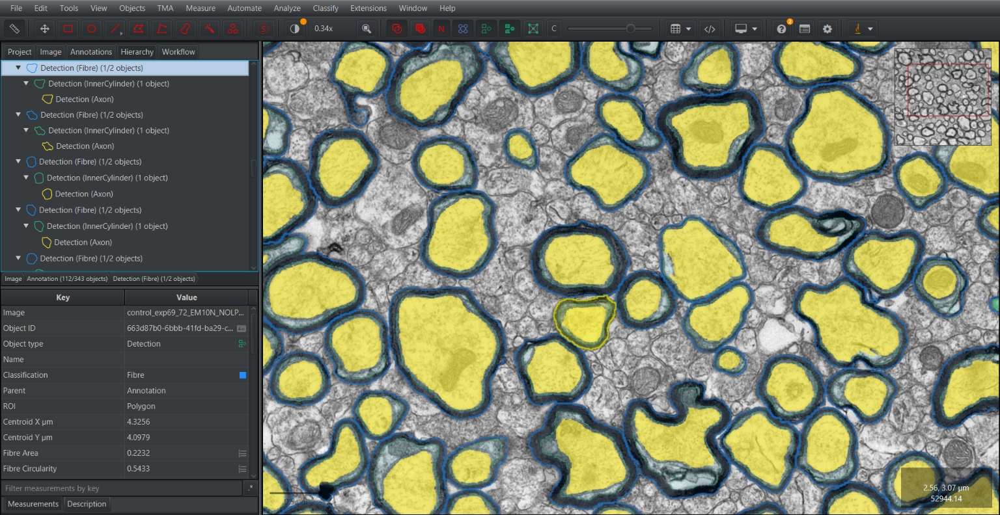

# AxonPath for QuPath

A [QuPath](https://qupath.github.io) extension for deep learning segmentation of myelinated nerve
fibres in **electron microscopy** and **brightfield** images.

AxonPath runs trained [AxonPath](https://github.com/paucabar/axonpath) models on regions you
select and turns the predictions into a QuPath object hierarchy:

- **Electron microscopy:** Fibre → InnerCylinder → Axon
- **Brightfield:** Fibre → Axon

Every fibre gets morphometric measurements (areas, g-ratios, circularity, solidity, axon count)
and per-compartment intensity statistics. The results can be corrected by hand and re-measured
without re-running the model, traced across z-slices, and exported for analysis or model training.

## Requirements

- QuPath **0.7.0** or later
- The PyTorch engine, downloaded once with **Extensions → Deep Java Library → Manage DJL engines**
  before the first run (see [Installation](docs/installation.md))
- A GPU is optional; models run on CPU too

## Installation

AxonPath is installed from its extension catalog, through QuPath's Extension Manager:

1. In QuPath, open **Extensions → Manage extensions**.
2. Click **Manage extension catalogs**, paste
   `https://github.com/paucabar/qupath-catalog-axonpath` and click **Add**.
3. Install **AxonPath** from the extension list and restart QuPath if prompted.

The extension then appears under **Extensions → AxonPath**. See [Installation](docs/installation.md)
for PyTorch and GPU setup.

## Quick start

1. [Download the models](docs/models.md) and select their directory in the AxonPath panel.
2. Open an image with its pixel size set.
3. Select the annotations to process, or click **Annotate whole image**.
4. Choose a model and input channel, and click **Run**.
5. Check the results and [measurements](docs/measurements.md); correct errors with
   [Review & Edit](docs/review-and-edit.md).

## Documentation

| Page | Content |
|---|---|
| [Installation](docs/installation.md) | Installing AxonPath and PyTorch, GPU support |
| [Models](docs/models.md) | Available models, download, model directory, model format |
| [Segmentation](docs/segmentation.md) | Running models from the AxonPath panel, parameters |
| [Review & Edit](docs/review-and-edit.md) | Correcting results by hand and recomputing |
| [Measurements](docs/measurements.md) | Every measurement and how it is computed |
| [3D tracing](docs/tracing.md) | Linking fibres across z-slices |
| [Export](docs/export.md) | Exporting measurements and annotations |
| [Scripting and batch processing](docs/scripting.md) | Script template and `AxonPathSegmenter` API |
| [Troubleshooting](docs/troubleshooting.md) | Common problems and errors |

## Citation

A preprint describing AxonPath is in preparation. Citation details will be added here.

To cite the models, use their Zenodo record:
[doi.org/10.5281/zenodo.22982902](https://doi.org/10.5281/zenodo.22982902).

## License

Apache License 2.0; see [LICENSE](LICENSE).
