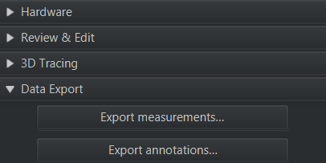
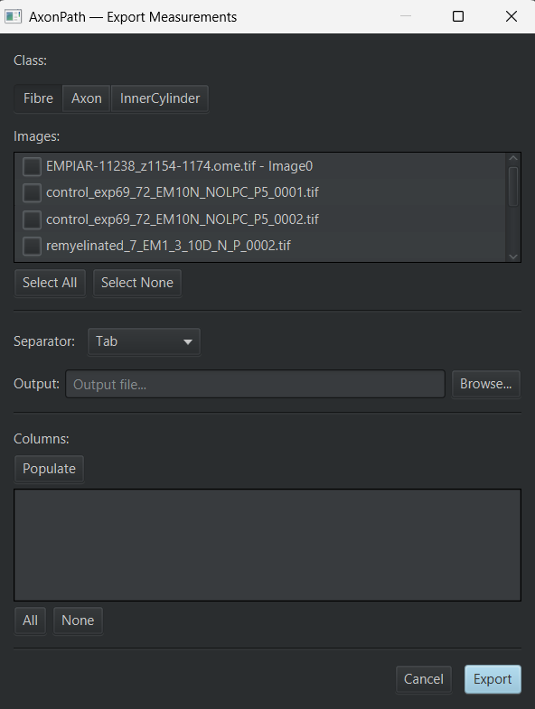
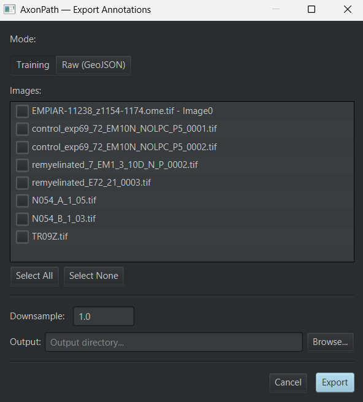

# Export

The **Data Export** section of the AxonPath panel exports results from the images in a **project**:
measurements as a table, or annotations as images for training or sharing. Both open a dialog where
you choose which project images to include.

The current image is saved before the dialog opens, so unsaved results are included.

## Export measurements

Exports the measurements of one object class, from the selected images, into a single table.

1. Click **Export measurements…**.
2. **Class:** choose `Fibre`, `Axon` or `InnerCylinder`. Each class is exported to its own table,
   because each has different measurements (see [Measurements](measurements.md)).
3. **Images:** tick the images to include (**Select All** / **Select None**).
4. **Separator:** Tab (default), Comma or Semicolon.
5. **Output:** choose the file (`.tsv`).
6. **Columns** (optional): click **Populate** to list the columns available in the selected images,
   then tick the ones to export (**All** / **None**). If you do not populate the list, all columns
   are exported.
7. Click **Export**.

### Table contents

Each row is one object. The first columns identify it:

| Column | Content |
|---|---|
| `Image` | Image name |
| `Object ID` | Unique ID of the object |
| `Classification` | `Fibre`, `Axon` or `InnerCylinder` |

These are followed by the measurements, and for `Axon` and `InnerCylinder` tables, by
**`Parent Fibre ID`**: the `Object ID` of the fibre the object belongs to. Use it to join an axon or
inner cylinder table to the fibre table.

Export after your last manual edit and recompute: recomputing creates new objects with new IDs (see
[Review & Edit](review-and-edit.md#what-recompute-does)).

## Export annotations

Exports images together with their annotations, in one of two modes.

1. Click **Export annotations…**.
2. **Mode:** **Training** or **Raw (GeoJSON)** (see below).
3. **Images:** tick the images to include.
4. Set the options for the mode and the **Output** folder.
5. Click **Export**.

Output file names are based on the image name. For z-stacks and time series, a `_z<n>` and/or
`_t<n>` suffix identifies the slice and timepoint.

### Training mode

Creates image/mask pairs, e.g. to train or fine-tune a segmentation model.

**Downsample** (default 1.0) sets the resolution of the exported images: 2 halves width and height.

The output folder gets three subfolders, with matching `.tif` file names:

| Folder | Content |
|---|---|
| `images/` | The image |
| `masks/` | Semantic mask: 0 background, 1 `Fibre`, 2 `InnerCylinder`, 3 `Axon` |
| `labels/` | Fibre instance labels: each fibre has its own number |

Objects are included whether they are detections or annotations, so results can be exported straight
after segmentation or mid-correction.

**Choosing the region to export:**

- **Unclassified annotations** define the regions: each one is exported as its own tile, named with
  a `_roi<n>` suffix. Draw unclassified annotations around the areas you want.
- **If there are none**, the whole image is exported, for each z-slice/timepoint that contains AxonPath
  objects (named `_roi0`).

Images without any AxonPath objects are still exported, with empty masks and labels, and are listed in
a warning.

### Raw (GeoJSON) mode

Exports images at full resolution with their annotations as GeoJSON, e.g. to back up curated
annotations or share them as a dataset.

| Folder | Content |
|---|---|
| `images/` | Full-resolution `.tif` image |
| `annotations/` | `.geojson` file with the annotations, same name as the image |

- One image and one GeoJSON file are exported for each z-slice/timepoint that contains annotations;
  slices without annotations are skipped.
- **All annotations** are exported, whatever their class. Detections are not; convert AxonPath
  results to annotations first if you want them included (see [Review & Edit](review-and-edit.md)).
- Annotations are saved as belonging to a single-plane image, so each GeoJSON can be imported
  directly onto its exported `.tif` in QuPath (drag and drop, or **File → Import objects from
  file**).
