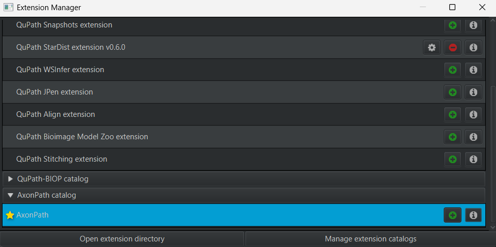

# Installation

## Requirements

- [QuPath](https://qupath.github.io) **0.7.0** or later
- An internet connection to download the PyTorch engine, once
- A GPU is optional. Models run on CPU; a supported NVIDIA GPU, or an Apple Silicon Mac, can make
  them faster

## Installing AxonPath

AxonPath is installed from its own extension catalog, with QuPath's Extension Manager:

1. In QuPath, open **Extensions → Manage extensions**.
2. Click **Manage extension catalogs**, paste
   `https://github.com/paucabar/qupath-catalog-axonpath` and click **Add**.
3. Install **AxonPath** from the extension list, and restart QuPath if prompted.

AxonPath then appears under **Extensions → AxonPath**.

## Installing PyTorch

AxonPath runs models with PyTorch, through QuPath's Deep Java Library (DJL) extension, which is
included with QuPath. The PyTorch engine is not downloaded automatically: download it once, **before
running AxonPath for the first time**:

1. Open **Extensions → Deep Java Library → Manage DJL engines**.
2. Click **Download** next to PyTorch and wait until it shows as available.

The engine is stored locally and reused by every extension that uses DJL.

### GPU support

- **NVIDIA GPUs** need a CUDA version compatible with the PyTorch engine. The DJL engine manager
  shows whether CUDA was found.
- **Apple Silicon** Macs can use the GPU through MPS.

Once PyTorch is available, the devices it supports appear under **Hardware → Preferred device** in
the AxonPath panel. When a GPU is not working, AxonPath can always run on CPU.

## Updating

AxonPath updates are installed from the Extension Manager: open **Extensions → Manage
extensions** and update AxonPath when a new version is listed.

## Next steps

- [Download the models](models.md)
- [Segment your first image](segmentation.md)
