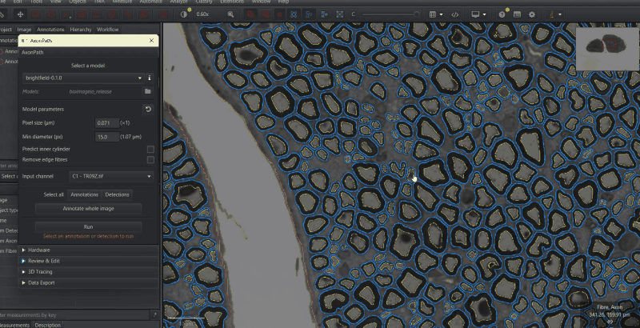

# Review & Edit

Segmentation is rarely perfect. The **Review & Edit** section of the AxonPath panel lets you correct
results by hand with QuPath's drawing tools and then recompute the hierarchy and measurements,
without running the model again.

## Why objects need converting

AxonPath creates its results as **detections**, which QuPath does not let you edit. To correct them
they are converted to **annotations**, edited, and converted back when measurements are recomputed.

## Workflow

1. **Select the parent** annotation (the region you segmented).
2. Click **Convert detections to annotations**. All Fibre, InnerCylinder and Axon detections under
   the parent become annotations. They are locked, to prevent accidental edits.
3. **Unlock** them with the unlock button, or unlock individual objects in QuPath
   (right-click → *Unlock*).
4. **Edit** with QuPath's tools:
   - Delete wrong objects.
   - Reshape objects with the brush or wand, or by editing their vertices.
   - Draw missing objects and set their class to `Fibre`, `InnerCylinder` or `Axon`.
5. **Lock** them again with the lock button if you want to protect them from further edits.
6. **Select the parent** again and click **Recompute hierarchy & measurements**.

The buttons are enabled only when they can be used: convert needs a selected parent with AxonPath
detections, and recompute, lock and unlock need a selected parent with AxonPath annotations.

## What Recompute does

For each selected parent, Recompute:

1. Collects the AxonPath annotations inside it, on the same z-slice and timepoint.
2. Converts them back to detections.
3. Rebuilds the hierarchy as segmentation does: each inner cylinder is assigned to the fibre that
   contains it, each axon to the inner cylinder (EM) or fibre (brightfield) that contains it, and
   objects outside any fibre, or fibres missing their contents, are removed.
4. Recomputes all [measurements](measurements.md).

So an object you draw only needs the right class and position; its place in the hierarchy is worked
out for you. A child object must lie (at least 90%) inside its parent object to be assigned to it;
parts sticking out of the parent are clipped.

Converting and recomputing create new objects. This means `Axon ID` from [3D tracing](tracing.md) is
removed, and object IDs change. Run tracing and export measurements after your last recompute.

## Tips

- **Classes:** AxonPath adds `Fibre`, `InnerCylinder` and `Axon` to QuPath's class list
  automatically, so they are available when drawing new objects.
- **Z-stacks:** Recompute and lock/unlock only affect objects on the parent's own z-slice. Select the
  parent on each slice you edited.
- **Deleting a fibre:** delete the fibre together with its axon and inner cylinder. Otherwise the
  leftovers are removed on recompute if they are not inside another fibre.
